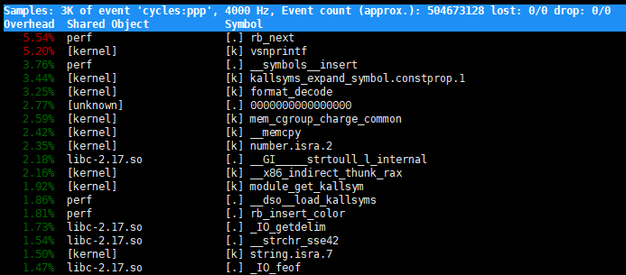

# CPU

###### 系统平均负载高

```shell
uptime
02:34:03 up 2 days, 20:14, 1 user, load average: 0.63, 0.83, 0.88
# 当前时间 系统运行时间       正在登录的用户数    1/5/15分钟平均负载
# 平均负载：系统处于可运行状态[running and runnable]和不可中断状态[uninterruptible sleep]的平均进程数[及平均活跃进程数]
# [uninterruptible sleep]:ps时，stat显示D，如等待硬件设备I/O响应的进程，系统对进程和硬件的一种保护机制

grep 'model name' /proc/cpuinfo | wc -l # 得出CPU核心数量
2
# CPU 密集型进程，使用大量 CPU 会导致平均负载升高，此时这两者是一致的；
# I/O 密集型进程，等待 I/O 也会导致平均负载升高，但 CPU 使用率不一定很高；
# 大量等待 CPU 的进程调度也会导致平均负载升高，此时的 CPU 使用率也会比较高；

# sysstat：性能工具包。包含mpstat和pidstat。
# mpstat：多核CPU性能分析工具，实时查看每个CPU的性能指标，以及所有CPU平均指标。
# pidstat：进程性能分析工具，实时查看进程的CPU/内存/IO/上下文切换等性能指标。
apt install stress sysstat

# stress:系统压力测试工具
stress --cpu 1 --timeout 600 #模拟持续600秒一个CPU使用率100%
stress -i 1 --timeout 600 #模拟持续600秒一个CPU不停地执行sync 使用率100%，及模拟IO压力
stress -c 8 --timeout 600 #模拟8个进程

watch -d uptime # watch观察命令输出, -d 参数表示高亮显示变化的区域
mpstat -P ALL 5 # 监控所有CPU的使用率，每5秒输出一组数据
pidstat -u 5 1 # 输出各个进程的CPU使用情况；观察5秒后输出一组数据
```

###### 上下文切换严重[硬件中断/软件中断 [上下文切换到中断处理程序]；同进程的线程间上下文切换/进程间上下文切换 的工作量和开销不同]

```shell
apt install sysbench sysstat
# 以10个线程运行5分钟的基准测试，模拟多线程切换的问题
sysbench --threads=10 --max-time=300 threads run

vmstat 5 # 每间隔5秒输出一组数据；系统的一些信息
procs -----------memory---------- ---swap-- -----io---- -system-- ------cpu-----
 r  b   swpd   free   buff  cache   si   so    bi    bo   in   cs us sy id wa st
 0  0  96256 4265788 2308036 58498780    0    0     0     4    0    0  0  0 100  0  0
 0  0  96256 4265640 2308036 58498812    0    0     0     0  164  138  0  0 100  0  0
r[running or runnable]:可运行队列和运行中的进程数量
b[blocked]:处于不可中断睡眠状态的进程数
in[interrupt]:每秒中断的次数
cs[context switch]:每秒上下文切换的次数
us[user]:用户态使用CPU时间
sy[system]:内核态使用CPU时间

pidstat -w 5 #每隔5秒输出1组数据
Average:      UID       PID   cswch/s nvcswch/s  Command
Average:        0         1      0.80      0.00  systemd
Average:        0         9     10.32      0.00  rcu_sched
Average:        0        11      0.27      0.00  watchdog/0
  cswch:进程每秒自愿上下文切换次数，高的话表示系统很少强占
nvcswch:进程每秒非自愿上下文切换次数，高的话表示系统较忙

pidstat -w -u 1# -w参数表示输出进程切换指标，而-u参数则表示输出CPU使用指标
Average:      UID       PID    %usr %system  %guest    %CPU   CPU  Command
Average:     1009      4398    0.66    1.66    0.00    2.32     -  pidstat
Average:        0     28571    0.00    0.33    0.00    0.33     -  kworker/8:1

Average:      UID       PID   cswch/s nvcswch/s  Command
Average:        0         1      0.66      0.00  systemd
Average:        0         9     14.24      0.00  rcu_sched

pidstat -wt 1 # -t 参数表示输出线程的指标

watch -d cat /proc/interrupts #观察各个CPU的中断情况
```

###### CPU利用率

```shell
#时间中断：每一个节拍触发一次。[内核中使用全局变量Jiffies记录开机以来的节拍数]。查看当前系统的节拍率(HZ)
$ grep 'CONFIG_HZ=' /boot/config-$(uname -r)
CONFIG_HZ=1000
# 内核还提供了一个用户空间节拍率 USER_HZ，它总是固定为 100

#/proc/stat 提供系统的 CPU 和任务统计信息
cat /proc/stat | grep ^cpu # 查看cpu开头的行：不同场景下CPU的累加节拍数，单位是USER_HZ
cpu  16604077 4158 3919911 15868803405 955663 0 285262 0 0 0
cpu0 1061392 139 316848 1322763764 54651 0 8857 0 0 0
cpu1 926280 104 264630 1323075364 23700 0 111 0 0 0
#每一列表示一种场景[man proc; 查找/proc/stat可以找到说明]，依次是:
#user   (1) Time spent in user mode.
#nice   (2) Time spent in user mode with low[1-19] priority (nice).
#system (3) Time spent in system mode.
#idle   (4) Time spent in the idle task.  This value should be USER_HZ times the second entry in the /proc/uptime pseudo-file. no include iowait.
#iowait (since Linux 2.5.41) (5) Time waiting for I/O to complete.
#irq (since Linux 2.6.0-test4) (6) Time servicing interrupts.
#softirq (since Linux 2.6.0-test4) (7) Time servicing softirqs.
#steal (since Linux 2.6.11) (8) Stolen time, which is the time spent in other operating systems when running in a virtualized environment
#guest (since Linux 2.6.24) (9) Time spent running a virtual CPU for guest operating systems under the control of the Linux kernel.
#guest_nice (since Linux 2.6.33) (10) Time spent running a niced guest (virtual CPU for guest operating systems under the control of the Linux kernel).
```


各种性能工具:取开始和结束的值，计算一小段时间内的使用率，然后显示:


top:默认起始间隔3秒，3秒刷新一次；

ps:默认进程整个生命周期为间隔时间；

```shell
#进程的CPU使用情况,值域通过man手册了解
/proc/[pid]/stat

#现成的方便性能工具:top/ps/pidstat

#程序哪行代码费CPU：
gdb:attach调试进程，但是会中断进程正常执行
perf:以性能事件采样为基础，分析系统和应用程序的性能问题
perf top #类似于top命令的交互界面,显示CPU始终占用的进程函数或指令排行
perf top -g -p 21515# -g 开启调用关系采样;-p指定进程id;
```



Samples:perf采样事件数量，过少的话可能不准

event:事件类型

Event count:事件总数量

Overhead:该符号的性能事件在采样中的比例

Shared:该函数或指令所在的动态共享对象[内核/进程名/动态链接库名/内核模块名]

Object:动态共享对象的类型 [.]:用户空间的可执行程序/动态库；[k]:内核空间

Syabol:符号名，及函数名，函数名未知时用16进制的地址表示

```shell
perf record #采样保存到当前目录perf.data，ctrl-C停止
perf record -g # -g 开启调用关系采样
perf report #展示类似于perf top的报告
```

###### 案例中用到的工具

```shell
# -a 表示输出命令行选项； p表PID； s表示指定进程的父进程
pstree -aps 3084
pstree | grep stress #查看stress进程的父进程

execsnoop # 专为短时进程设计的工具。通过ftrace[动态追踪技术]实时监控进程的exec()行为，输出短时进程的基本信息
```

top命令中，进程的状态:

R 是 Running 或 Runnable 的缩写，表示进程在 CPU 的就绪队列中，正在运行或者正在等待运行。

D 是 Disk Sleep 的缩写，也就是不可中断状态睡眠（Uninterruptible Sleep），一般表示进程正在跟硬件交互，并且交互过程不允许被其他进程或中断打断。

Z 是 Zombie 的缩写，如果你玩过“植物大战僵尸”这款游戏，应该知道它的意思。它表示僵尸进程，也就是进程实际上已经结束了，但是父进程还没有回收它的资源（比如进程的描述符、PID 等）。

S 是 Interruptible Sleep 的缩写，也就是可中断状态睡眠，表示进程因为等待某个事件而被系统挂起。当进程等待的事件发生时，它会被唤醒并进入 R 状态。

I 是 Idle 的缩写，也就是空闲状态，用在不可中断睡眠的内核线程上。前面说了，硬件交互导致的不可中断进程用 D 表示，但对某些内核线程来说，它们有可能实际上并没有任何负载，用 Idle 正是为了区分这种情况。要注意，D 状态的进程会导致平均负载升高， I 状态的进程却不会。

T 或者 t，也就是 Stopped 或 Traced 的缩写，表示进程处于暂停或者被跟踪状态。

​	SIGSTOP信号:使进程进入暂停状态

​	SIGCONT信号:使进程从T状态恢复运行

​	gdb断点：使进程进入被跟踪状态

X 是Dead缩写，表示进程以及消亡，在top和ps中看不到，僵尸进程被回收后用此状态表示。

s 表示该进程是一个会话的领导进程，+表示前台进程组

```shell
#dstat 同时观察CPU/磁盘IO/网络和内存的使用情况，需要安装
dstat 1 10 #每1秒输出10组数据

#-d 展示 I/O 统计数据，-p 指定进程号，间隔 1 秒输出 3 组数据
pidstat -d 1 3

strace -p 6082 #跟踪进程系统调用
```

###### 中断

上半部：硬件请求，直接打断CPU正在执行的任务，在中断禁止模式[不响应任何中断]下运行。

下半部：内核触发，以内核线程的方式运行，每个CPU都对应一个软中断内核线程[ksoftirqd/CPU 编号]，延迟处理在上半部中未完成的工作。下半部包含于软中断

```shell
ps aux | grep softirq
#/proc/softirqs 提供了软中断的运行情况；会显示软中断类型和在CPU上的分布
#/proc/interrupts 提供了硬中断的运行情况；
watch -d cat /proc/softirqs
                     CPU0           CPU1
HI[]:                  0              0
TIMER[定时中断]:       1083906        2368646
NET_TX[网络发送]:      53             9
NET_RX[网络接收]:      1550643        1916776
BLOCK[]:              0              0
IRQ_POLL[]:          0              0
TASKLET[]:          333637         3930
SCHED[内核调度]:       963675         2293171
HRTIMER[]:             0              0
RCU[RCU锁]:         1542111        1590625
```

```shell
# sar:系统活动报告工具。
# hping3:可构造TCP/IP协议数据包的工具。
# tcpdump:网络抓包工具。

# -S参数表示设置TCP协议的SYN（同步序列号）[SYN FLOOD攻击]，-p表示目的端口为80
# -i u100表示每隔100微秒发送一个网络帧
# 注：如果你在实践过程中现象不明显，可以尝试把100调小，比如调成10甚至1
hping3 -S -p 80 -i u100 192.168.0.30 #Ctrl+C 停止

# -n DEV 表示显示网络收发的报告，间隔1秒输出一组数据
sar -n DEV 1

# -i eth0 只抓取eth0网卡，-n不解析协议名和主机名
# tcp port 80表示只抓取tcp协议并且端口号为80的网络帧
tcpdump -i eth0 -n tcp port 80
15:11:32.678966 IP 192.168.0.2.18238 > 192.168.0.30.80: Flags [S], seq 458303614, win 512, length 0...
```


```shell
# 工具总结
uptime
top
ps
mpstat
vmstat
pidstat
perf
pstree
execsnoop
dstat
strace
/proc/cpuinfo
/proc/interrupts
/proc/stat
/proc/[pid]/stat
/boot/config-$(uname -r)
```


# 内存

###### buffer & cache

```shell
free -h
# buffer:/proc/meminfo中的Buffers值。内核缓冲区用到的内存。读写磁盘的缓存
# cache:/proc/meminfo中的Cached与SReclaimable 之和。内核页缓存和slab用到的内存。读写文件的缓存

# 清理文件页、目录项、Inodes等各种缓存
echo 3 > /proc/sys/vm/drop_caches

vmstat 1 #每秒输出1组，观察变化
dd if=/dev/urandom of=/tmp/file bs=1M count=500 #写文件时，cache值增大
dd if=/dev/urandom of=/dev/sdb1 bs=1M count=2048 #写磁盘时，buffer值增大
dd if=/tmp/file of=/dev/null #读文件时，cache值增大
dd if=/dev/sda1 of=/dev/null bs=1M count=1024 #读磁盘时，buffer值增大

# cachestat 提供了整个操作系统缓存的读写命中情况，bcc 软件包的一部分
# cachetop 提供了每个进程的缓存命中情况，bcc 软件包的一部分
# ubuntu安装bcc-tools,需要内核4.1以上
sudo apt-key adv --keyserver keyserver.ubuntu.com --recv-keys 4052245BD4284CDD
echo "deb https://repo.iovisor.org/apt/xenial xenial main" | sudo tee /etc/apt/sources.list.d/iovisor.list
sudo apt-get update
sudo apt-get install -y bcc-tools libbcc-examples linux-headers-$(uname -r)
export PATH=$PATH:/usr/share/bcc/tools

cachestat 1 3
   TOTAL   MISSES     HITS  DIRTIES   BUFFERS_MB  CACHED_MB
       2        0        2        1           17        279
       2        0        2        1           17        279
       2        0        2        1           17        279 
  总IO次数  缓存未命中次 缓存命中 新增到缓存的脏页 
cachetop # 类top命令

# pcstat:指定文件的缓存大小。先安装go语言，再安装pcstat
export GOPATH=~/go
export PATH=~/go/bin:$PATH
go get golang.org/x/sys/unix
go get github.com/tobert/pcstat/pcstat

pcstat /bin/ls #查看ls文件的缓存情况
strace -p $(pgrep app) # 利用shell语法生成app进程的pid，直接strace
```

###### 内存泄漏

```shell
#内存紧张时，系统通过回写脏页、利用swap，最终OOM （Out of Memory）机制杀死占用内存最多的进程
vmstat 1 #每秒1次打印内存信息
# pmap -x 查看进程内存分布

# memleak:bcc软件包中的一个工具,用于检测内存泄漏[valgrind也可以检测内存泄漏]
# -a 表示显示每个内存分配请求的大小以及地址
# -p 指定案例应用的PID号
/usr/share/bcc/tools/memleak -a -p $(pidof app) #pidof如果有多个结果不换行，pgrep有多个结果时换行
```


# I/O


# 网络


# 综合


